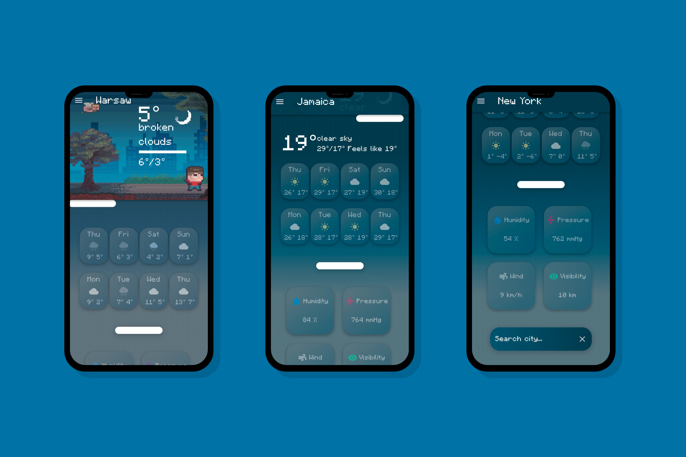
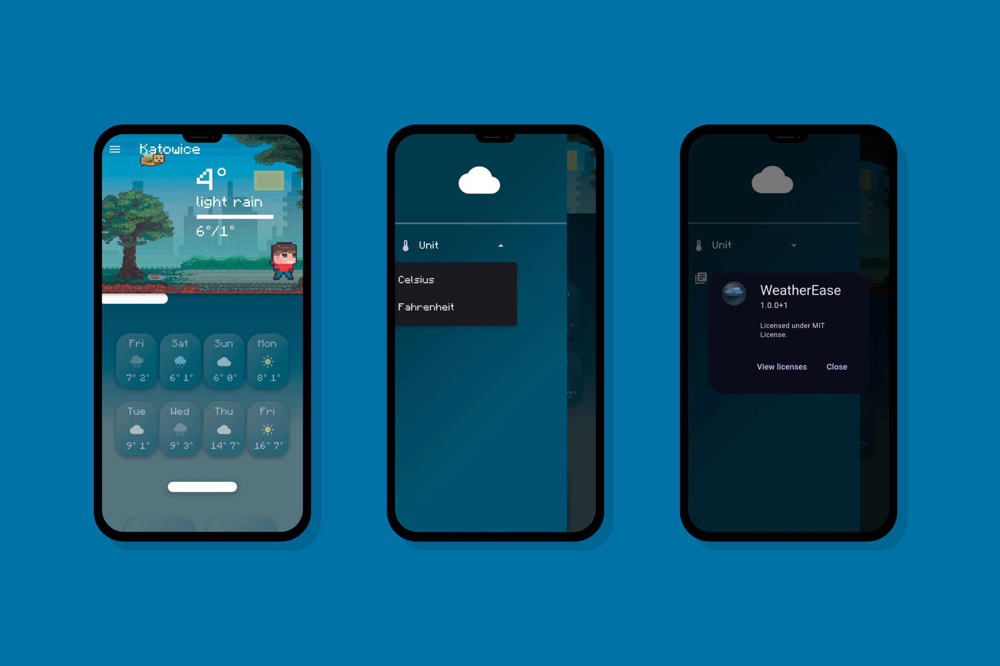

# ☀️ WeatherEase
🌍 WeatherEase is a responsive weather app built with Flutter. It provides real-time weather forecasts by fetching data from the OpenWeatherMap API. The app automatically detects your location or allows you to search for any city. It supports both Celsius and Fahrenheit for temperature display and provides a clean, modern design with detailed forecast information.

## 📸 Screenshots

  
  

## ✨ Key Features

-   **📱 Responsive Design** – WeatherEase ensures a seamless experience across all devices, from large desktop screens to compact smartphones, with a clean and intuitive interface.
-   **⛅ Live Weather Updates** – Fetches real-time weather data using the OpenWeatherMap API, providing accurate forecasts for any location.
-   **📍 Location Detection & Search** – Automatically detects your current location or allows manual city searches for flexibility.
-   **🌡️ Temperature Unit Selection** – Supports both Celsius and Fahrenheit, letting users choose their preferred format.
-   **📊 Detailed Forecast** – Displays current conditions, temperature ranges, and weather descriptions in an organized and visually appealing layout.
-   **🎨 Smooth Animations & Modern Design** – A polished UI with subtle animations enhances the user experience without distraction.

## 🔄 State Management

This project uses the `Provider` package for state management to ensure efficient and scalable state handling.

## 🔑 API Key

This project uses the OpenWeatherMap API to fetch weather data. To use the app, you will need your own API key.

### Steps to Add Your API Key:

1. Go to OpenWeatherMap and sign up.
2. Copy your API key.
3. Create a `.env` file in the root of your project (if it doesn’t already exist).
4. Add the following line to your `.env` file:

   `OPENWEATHER_API_KEY=your_api_key_here`

## ⚡Installation

1. Clone the repository:

```bash 
git clone https://github.com/Clamata/Flutter-Weather-Ease-app.git
```  

2. Navigate to the project directory:
  ```bash 
cd Flutter-Weather-Ease-app 
```  
3. Install dependencies:
  ```bash 
flutter pub get  
```  
4. Run the app:
  ```bash 
flutter run  
```  

## 📜 License

This project is licensed under the MIT License - see the [LICENSE](LICENSE) file for details.